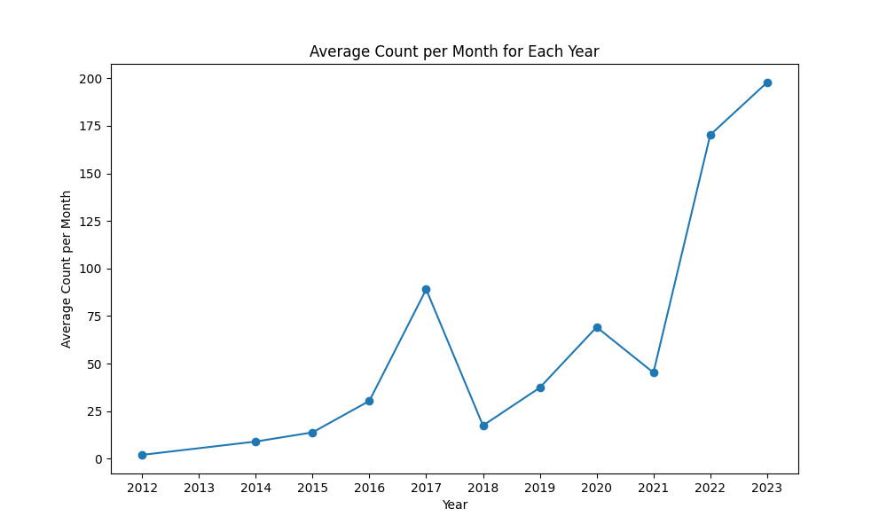
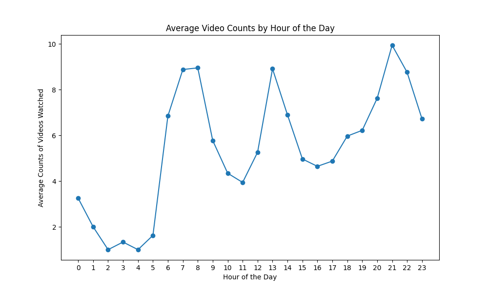
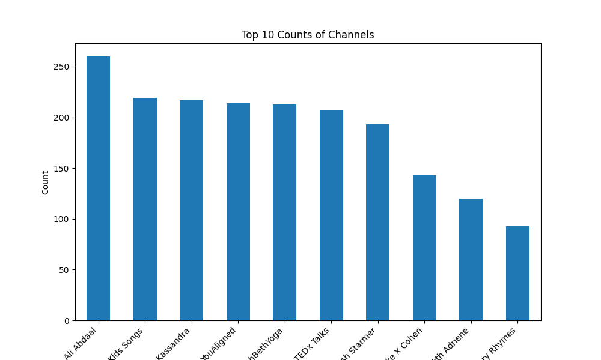
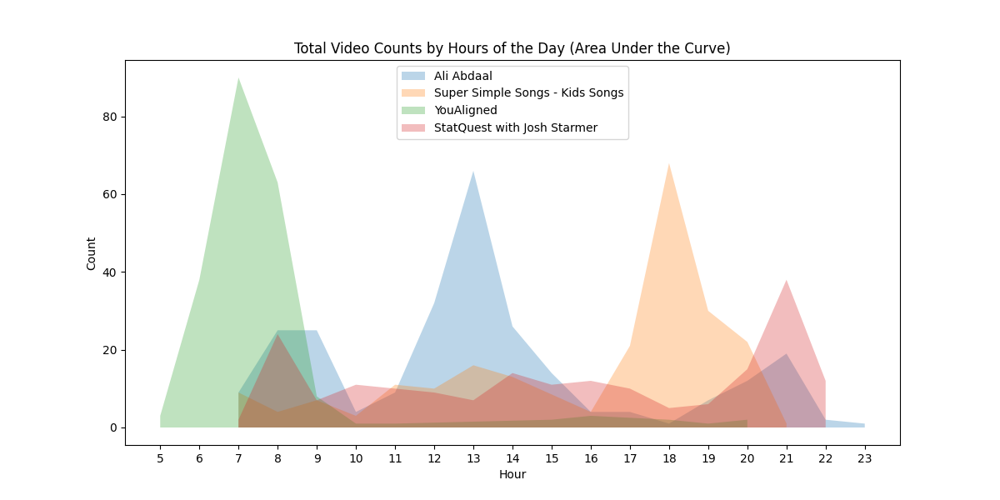
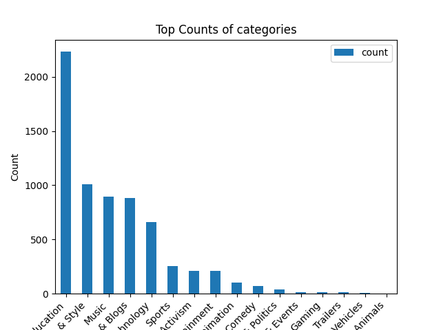
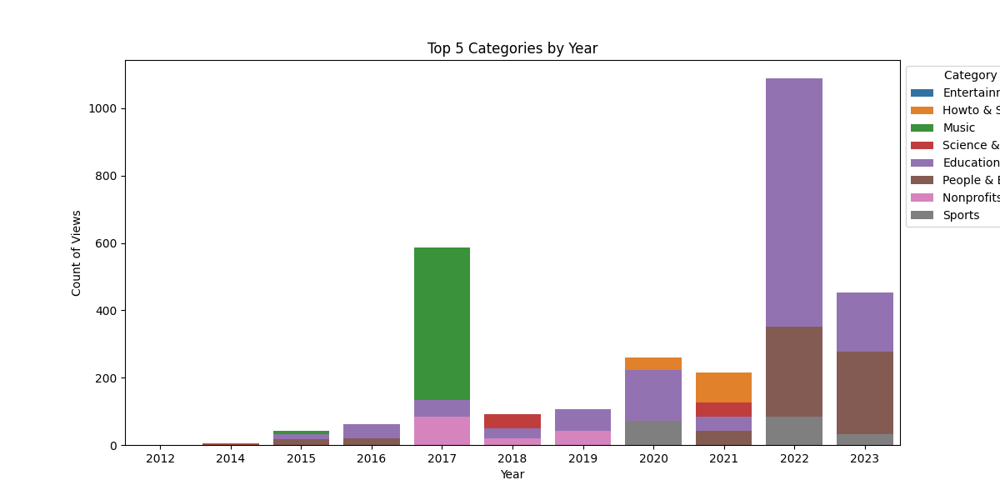
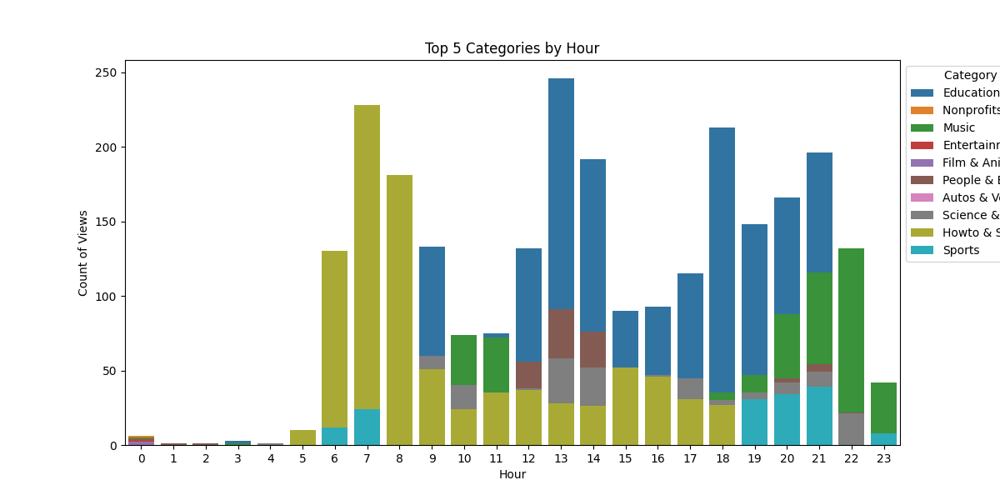

# README

## Step 1: Data Extraction

- Purpose: Extract my personal YouTube viewing history data from the downloaded HTML file provided by YouTube. See here for [how](https://webapps.stackexchange.com/questions/101263/how-can-i-export-youtubes-personal-history) to download it.

## Step 2: Data Cleaning and Feature Generation

- Purpose: Clean and transform the extracted data to make it suitable for analysis.
    - Remove any missing values and ensure the data is in a consistent format.
    - Clean text data using NLP tools
    - Generate additional features such as year, month, weekdays vs. weekends, hour, and time of day.
    - Convert the 'Duration' column to total seconds.
    - Generate additional features: LikeViewRatio

## Step 3: Visualize data to identify patterns

### Purpose 1: Explore and analyze the YouTube viewing history data to gain insights into my viewing habits.

**Viewing Habits:**

- Calculate and visualize the average count of videos watched per month for each year.
    - Insights: A significant increase in the average count of videos watched per month in 2017 and a continued rise from 2022 onwards.
- Determine the average count of videos watched based on the hour of the day.
    - Insights: My viewing patterns had three peaks: early morning for yoga, midday during my lunch break, and late evening before bedtime.
- Identify the top channels I have watched since 2016 and visualize their counts.
    - Insights: The channels I watched the most belonged to self-development, yoga, education, and nursery songs categories.

 

 

 

**Video Distribution:**

- Visualize the distribution of video counts across different hours of the day for specific YouTube channels.
    - Insights: Specific hours of the day were associated with different video categories: yoga in the early morning, self-development in the afternoon, children's content in the evening, and statistics study in the late evening.
- Create a word cloud to visualize the frequency of video titles
    - Insights: The most frequently watched videos were related to yoga, followed by workout-related content.

### Purpose 2: Explore and analyze the YouTube metadata to gain insights into the features of the data.

**YouTube Metadata:**

- Visualize the distribution of video categories based on the extracted metadata.
    - Insight: I primarily watch youtube videos for two purposes: learning and entertaining my son at home.
- Visualize how the video categories change over the years
    - Insight:
    - The video categories I watched for educational purposes increased notably in 2020, 2022, and 2023.
    - People & Blogs category showed a similar trend.
    - I also listened to music on YouTube in 2017.

 

**Changing Video Categories:**

- Visualize how the video categories change over the years
    - Insight: Over time, my video categories shifted, with a focus on yoga in the early morning, educational videos during and after work hours (particularly on statistical analysis and data science), and music in the morning and evening for background and entertaining my son.

### Summary of my personal data

- My viewing habits have evolved over the years, with a significant increase in video consumption in 2017 and onwards.
- I tend to watch videos during specific hours for various purposes such as yoga in the morning, self-development in lunch time, education during working hours and evening time, and entertaining my son in the evening time.
- I primarily watch YouTube videos for learning and have observed changes in the categories I consume, including an increase in educational content in recent years.

## Step 4: Data modeling: To predict the Like Counts for all videos

### 4a: Further clean and visualize the data, identify extreme data points

- Drop videos that have been watched multiple times
- Visualize the distribution of data: highly skewed
- Additional data clean: remove data points that have too many or too few view counts, too many like counts, too long or zero duration, zero or too few likes (probably the video turned off the comment button)
- Log-transform data to make them have normal distributions
- Visualize the relationship between variables, separated by categories

### 4b: Feature generation

- Calculate the number of words for each title
- Decide what features to include in the model
- Decide the type of model: General linear regression, with both continuous and categorical data.
- Features:
    - m1-orig: ['SubscriberCount_log', 'ViewCount_log', 'Duration_log', 'TitleLength']
    - m2-orig-category: ['SubscriberCount', 'ViewCount', 'Duration', 'TitleLength', 'CategoryName']
    - m3-log: [ 'SubscriberCount_log', 'ViewCount_log', 'Duration_log', 'TitleLength', 'CategoryName']
    - m4-log-category: ['SubscriberCount_log', 'ViewCount_log', 'Duration_log', 'TitleLength']
- Dependent variables: Use LikeViewRatio instead of ViewCount because it’s unsurprising that popular videos with higher view counts tend to attract more engagement in the form of likes.

### 4c: Build and compare different models

- Be cautious: LikeView ratio is generated by dividing the View counts by Like counts, so if I included both View counts and Like counts in the model, the model will 100% predict the LikeView ratio.
- Model evaluation by examining the explained variance on the tested data (using cross-validation):
- The log-transformed features together with the categorical information can best predict the testing data.

### 4d: Feature extraction: Identify the most important features

**Higher Likability Categories:**

- Videos in the People & Blogs, Sports, Education, and How-to & Style categories demonstrate a higher likability among viewers, as they tend to receive a greater percentage of likes relative to the total number of views.
- These categories exhibit a higher proportion of likes per view, suggesting that viewers find the content engaging and enjoyable.

**Lower Likability Categories:**

- In contrast, the Film & Animation, Travel & Events, and Autos & Vehicles categories show a lower likability among viewers, as they have a lower percentage of likes compared to the total number of views.
- Videos in these categories receive a smaller proportion of likes per view, indicating a lower level of likability among viewers.

**Other Features:**

- The number of subscribers and video duration do not strongly predict the percentage of likes. This implies that while having a larger subscriber base may indicate a loyal audience, it does not strongly influence the proportion of likes received.
- Similarly, the duration of the video or the number of words in the video title does not predict the percentage of likes.

### 4e: Future analysis

- Explore the interaction between Categories and other features
- Use other models to identify important features, such as random forest

### Summary of the findings

Videos in the People & Blogs, Sports, Education, and How-to & Style categories have a higher likability, receiving a greater proportion of likes relative to the total views. In contrast, the Film & Animation, Travel & Events, and Autos & Vehicles categories exhibit lower likability, with a smaller percentage of likes compared to the total views. Factors such as the number of subscribers, video duration, and video title length do not strongly predict the likability of videos in terms of the percentage of likes received.

## Business insights based on my personal data and Youtube metadata:

**Enhancing Likability and Engagement with Targeted Content Strategy**

- Videos in the People & Blogs, Sports, Education, and How-to & Style categories have shown higher likability, receiving a greater proportion of likes relative to total views.
- To capitalize on these likability trends, consider focusing content strategy on creating compelling educational content within these categories.
- By aligning the content with viewer preferences, we can increase engagement and attract a broader audience.

**Personalization and Timely Promotions for Optimal Viewer Experience**

- Implementing personalized content recommendations based on viewer preferences and viewing habits can significantly enhance the viewer experience.
- Additionally, schedule targeted promotions during specific timeframes to maximize viewership and engagement.
- By delivering content tailored to the right audience at the right time, we can increase likability and viewer satisfaction.
